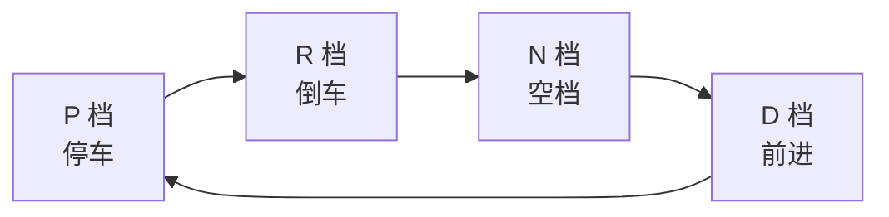

# 汽车微处理器原理与应用实验任务书

## 实验七：汽车档位模拟器设计

---

## 一、实验基本信息

| 项目 | 内容 |
|------|------|
| **实验名称** | 汽车档位模拟器设计 |
| **课程名称** | 汽车微处理器原理与应用 |
| **实验学时** | 2学时 |
| **实验类型** | 设计性实验（团队任务） |
| **适用专业** | 汽车服务工程 |
| **先修课程** | C语言程序设计 |

---

## 二、实验目的

1. 掌握STM32F407 GPIO外部中断的配置方法
2. 理解中断服务程序的设计与实现
3. 学习使用DWT计数器实现精准按键消抖
4. 掌握状态机思想在嵌入式系统中的应用
5. 培养硬件与软件结合的调试能力

---

## 三、实验设备与工具

### 3.1 硬件设备

| 设备名称 | 型号/规格 | 数量 |
|----------|-----------|------|
| STM32最小系统板 | STM32F407ZGT6 | 1块 |
| USB数据线 | Micro-USB | 1根 |
| ISP串口烧录工具 | USB转TTL/CH340 | 1个 |
| 杜邦线 | 若干 | 若干 |

**烧录说明：** 本实验使用 ATK-XISP 烧录工具配合 ISP 下载方式进行固件烧录。

### 3.2 软件工具

| 软件名称 | 用途 |
|----------|------|
| STM32CubeMX | 引脚配置与代码生成 |
| MDK-ARM（Keil） | 工程编译 |
| ATK-XISP | 固件烧录（ISP方式） |
| 串口调试助手 | 通信调试（选做部分使用） |

---

## 四、实验原理

### 4.1 系统功能描述

本实验设计一个汽车档位模拟器，通过按键控制档位在P（停车档）、R（倒车档）、N（空档）、D（前进档）之间循环切换，并通过LED显示当前档位状态。

**汽车电子应用背景：**
在实际汽车电子系统中，档位信息由变速杆位置传感器（档位传感器）采集，发送给变速箱控制单元（TCU）或发动机控制单元（ECU）。本实验模拟了这一基本功能，帮助学生理解汽车电子控制系统的输入/输出处理原理。

### 4.2 硬件连接

```
┌─────────────────────────────────────────────────────────┐
│                   STM32F407开发板                        │
│                                                         │
│    PE4 ◄────── KEY0按键（输入，下降沿触发）               │
│    PF9 ───────► LED0（输出，低电平点亮）                  │
│    PF10 ──────► LED1（输出，低电平点亮）                  │
│                                                         │
└─────────────────────────────────────────────────────────┘
```

### 4.3 引脚配置

| 功能 | GPIO引脚 | 模式 | 上拉/下拉 |
|------|----------|------|-----------|
| KEY0 | PE4 | 外部中断（下降沿） | 上拉 |
| LED0 | PF9 | 推挽输出 | 无 |
| LED1 | PF10 | 推挽输出 | 无 |

### 4.4 档位显示逻辑

| 档位 | LED0 | LED1 | 说明 |
|------|------|------|------|
| P（停车档） | 亮 | 灭 | 仅LED0点亮 |
| R（倒车档） | 灭 | 亮 | 仅LED1点亮 |
| N（空档） | 灭 | 灭 | 两灯全灭 |
| D（前进档） | 亮 | 亮 | 两灯全亮 |

### 4.5 技术要点

#### 4.5.1 外部中断配置

使用EXTI4外部中断线检测PE4引脚的下降沿信号：

```c
GPIO_InitStruct.Mode = GPIO_MODE_IT_FALLING;  // 下降沿触发
GPIO_InitStruct.Pull = GPIO_PULLUP;          // 内部上拉
HAL_NVIC_SetPriority(EXTI4_IRQn, 0, 0);      // 中断优先级配置
HAL_NVIC_EnableIRQ(EXTI4_IRQn);              // 使能中断
```

#### 4.5.2 DWT消抖原理

利用Cortex-M4内核的DWT（Data Watchpoint and Trace）单元实现精准延时消抖：

- DWT CYCCNT寄存器以CPU频率（168MHz）计数
- 50ms对应：168MHz × 0.05s = 8,400,000个周期
- 中断触发时检查与上一次触发的时间间隔

#### 4.5.3 状态机设计

采用状态机思想管理档位切换，状态转移图如下：



---

## 五、实验内容与要求

### 5.1 基本要求（必做）

1. **完成GPIO配置**
   - 配置PE4为外部中断输入模式
   - 配置PF9、PF10为推挽输出模式
   - 正确设置中断优先级

2. **实现中断服务程序**
   - 编写EXTI4中断处理函数
   - 实现HAL_GPIO_EXTI_Callback回调函数
   - 添加DWT消抖逻辑

3. **实现档位控制逻辑**
   - 定义档位枚举类型
   - 实现档位切换函数
   - 实现LED显示更新函数

4. **系统集成与调试**
   - 在main函数中初始化各模块
   - 设置初始档位为P档
   - 烧录验证功能

### 5.2 提高要求（选做）

1. 添加按键长按功能（长按2秒复位到P档）
2. 使用串口输出当前档位信息
3. 添加档位切换的防误操作逻辑（如D档不能直接切到R档）

---

## 六、实验步骤

### 6.1 创建工程

1. 使用STM32CubeMX创建新工程
2. 选择芯片型号：STM32F407ZGTx
3. 配置系统时钟为168MHz

### 6.2 引脚配置

1. 配置PF9、PF10为GPIO_Output，命名为LED0、LED1
2. 配置PE4为GPIO_EXTI4，命名为KEY0，设置为下降沿触发、上拉
3. 在NVIC Settings中使能EXTI4中断

### 6.3 代码编写

1. 在main.c中添加档位枚举和变量定义
2. 实现LED_Update()函数
3. 实现Gear_Shift()函数
4. 在stm32f4xx_it.c中实现中断回调函数

### 6.4 编译烧录

1. 使用 STM32CubeMX 生成 MDK-ARM 工程代码
2. 使用 MDK-ARM（Keil）打开工程并编译，生成 .hex 文件
3. 使用 ATK-XISP 软件配合 USB 转串口工具将 .hex 文件烧录到开发板
4. 烧录完成后按下 KEY0 按键，观察 LED 变化

### 6.5 调试记录

记录调试过程中遇到的问题及解决方案：

| 问题现象 | 可能原因 | 解决方法 |
|----------|----------|----------|
| 按键无反应 | 引脚配置错误 | 检查PE4配置 |
| 档位乱跳 | 未消抖 | 添加DWT消抖 |
| LED不亮 | GPIO初始化错误 | 检查PF9/PF10配置 |

---

## 七、预期实验结果

1. **上电初始状态**
   - LED0点亮，LED1熄灭（显示P档）

2. **按键操作**
   - 每按一次KEY0，档位按P→R→N→D→P顺序循环
   - LED显示与档位对应关系正确

3. **消抖效果**
   - 快速连续按键不会产生误触发
   - 每次有效按键间隔至少50ms

---

## 八、思考题

1. 为什么按键要配置为下降沿触发而不是上升沿触发？
2. DWT消抖与软件延时消抖相比有什么优势？
3. 如果要求从D档不能直接切换到R档（需经过N档），如何修改代码？
4. 中断服务程序中为什么要尽量少执行代码？
5. 本实验的LED是低电平点亮还是高电平点亮？代码中如何体现？
6. **汽车电子应用题：** 在实际汽车中，档位传感器通常采用什么类型的信号（数字量/模拟量/总线信号）？
7. **拓展思考：** 如果要实现一个包含S（运动档）或L（低速档）的多档位系统，应该如何修改状态机设计？

---

## 九、实验报告要求与评分标准

### 9.1 报告章节与分值分配

实验报告共8个章节。实验总分100分，其中书面报告占90分，实验态度10分由教师单独评定。

| 报告章节 | 分值 | 评分项归属 |
|----------|:----:|------------|
| 一、团队信息与分工 | 5分 | 团队协作 |
| 二、实验目的与原理 | 10分 | 实验原理与认知 |
| 三、硬件设计与连接 | 15分 | 实验完成度 |
| 四、软件设计与实现 | 30分 | 代码质量 |
| 五、实验结果分析 | 20分 | 实验完成度 |
| 六、问题与讨论 | 5分 | 实验报告质量 |
| 七、思考题回答 | 5分 | 实验报告质量 |
| 八、附录：核心代码 | — | 注释质量已含在第四项中 |
| **报告书面总分** | **90分** | |
| 实验态度（教师评定） | 10分 | 出勤、操作规范 |
| **最终总分** | **100分** | |

### 9.2 各章节内容要求与评分细则

#### 一、团队信息与分工（5分，团队协作）
- **内容要求**：成员基本信息、个人分工说明、团队协作过程记录（讨论截图、会议纪要等）。
- **评分要点**：
  - 4-5分：分工明确，协作记录真实，每位成员贡献均衡。
  - 2-3分：分工较合理，有协作记录，个别成员贡献略少。
  - 0-1分：分工模糊，无协作记录或贡献明显不均。

#### 二、实验目的与原理（10分，实验原理与认知）
- **内容要求**：实验目的、外部中断/DWT消抖/状态机原理、汽车电子应用场景。
- **评分要点**：原理阐述准确且结合汽车电子实例得8-10分，基本正确得5-7分，错误较多得1-4分，缺失不得分。

#### 三、硬件设计与连接（15分，实验完成度）
- **内容要求**：硬件连接图、引脚配置理由、ISP烧录电路说明（如有）。
- **评分要点**：连接图正确清晰10分，引脚配置说明完整5分。

#### 四、软件设计与实现（30分，代码质量）
- **内容要求**：程序流程图、关键代码及详细注释、中断服务程序说明、各成员负责的代码模块。
- **评分要点**：
  - 26-30分：流程图清晰，代码完整规范，注释详尽，中断逻辑正确，模块划分合理。
  - 18-25分：代码基本正确，注释较少，结构一般。
  - 0-17分：代码有明显错误，注释缺失或逻辑混乱。

#### 五、实验结果分析（20分，实验完成度）
- **内容要求**：每次按键后的LED状态记录、照片/截图、与预期结果对比分析。
- **评分要点**：现象记录完整8分，截图清晰且标注清楚4分，对比分析透彻8分。

<<<<<<< HEAD:docs/07_car_gear_experiment.md
- 报告采用 **Word（.doc/.docx）或 WPS 文字** 格式编写
- 代码使用等宽字体（如Consolas、Courier New），关键部分加注释
- 图表清晰，有图题和编号
- 照片嵌入文档，适当标注
- 报告总字数不少于2000字
=======
#### 六、问题与讨论（5分，实验报告质量）
- **内容要求**：调试中遇到的问题及解决方法（建议表格）、团队协作解决过程、每位成员独立撰写的个人心得（不少于150字）。
- **评分要点**：问题记录真实、分析深入、心得个人化且深刻得4-5分；较简单得2-3分；心得雷同该项计0分。
>>>>>>> 7662693 (feat: 增强实验报告查重与评分系统 (v2.1)):docs/teaching/2026-春季/汽服2302B班/docs/task.md

#### 七、思考题回答（5分，实验报告质量）
- **内容要求**：逐一回答任务书第八章全部思考题。
- **评分要点**：全部正确得5分，每错1题扣1分，扣完为止。

<<<<<<< HEAD:docs/07_car_gear_experiment.md
- **提交平台：** 学习通（超星学习平台）
- **提交时间：** 本周内完成并提交
- **提交方式：** 每位成员单独提交
- **文件命名：** `组号-姓名.docx`（例如：第1组-张三.docx）
- **内容说明：** 同组成员可提交完全一致的报告内容，**仅"个人心得体会"部分需独立撰写**
- **提交检查：** 提交前请确认文件可正常打开，内容完整
=======
#### 八、附录：核心代码
- 仅需附完整代码，注释质量已包含在第四项"软件设计与实现"评分中。
>>>>>>> 7662693 (feat: 增强实验报告查重与评分系统 (v2.1)):docs/teaching/2026-春季/汽服2302B班/docs/task.md

### 9.3 报告格式与提交要求

**格式要求**
- 文件格式：Word（.docx）或WPS文字。
- 正文字体：宋体，小四号（12pt），1.35倍行距。
- 代码字体：等宽字体（Consolas/Courier New），关键语句加注释。
- 图表需编号并配标题，照片嵌入文档并标注关键信息。
- 总字数不少于2000字（不含代码）。

**提交要求**
- 平台：学习通（超星学习平台），截止时间以教师通知为准。
- 每位成员独立提交，文件命名：`组号-姓名.docx`（例：第1组-张三.docx）。
- 除"个人心得"必须独立撰写外，同组其他内容可相同。
- 逾期每日扣5分，逾期超过3天该次实验不予受理。

### 9.4 总分构成与特殊规则

| 评分项 | 满分 | 来源 |
|--------|:----:|------|
| 团队协作 | 5分 | 报告一 |
| 实验原理与认知 | 10分 | 报告二 |
| 实验完成度 | 35分 | 报告三（15）+ 报告五（20） |
| 代码质量 | 30分 | 报告四 |
| 实验报告质量 | 10分 | 报告六（5）+ 报告七（5） |
| 实验态度 | 10分 | 教师评定 |
| **总计** | **100分** | |

<<<<<<< HEAD:docs/07_car_gear_experiment.md
- **组长额外加分：** 成功组织团队完成实验，组长可获5分附加分
- **个人评分：** 根据个人在团队中的实际贡献进行差异化评分
- **缺勤处理：**
  - 个人缺勤：缺勤1次扣该成员个人分5分；缺勤2次及以上，该成员本次实验记0分
  - 团队缺勤：团队中超过半数成员缺勤，本次团队实验记0分
  - 请假说明：因病或有事需提前请假者，经教师批准后可补做实验，不扣分
=======
**特殊规则**
- **组长附加分**：有效组织团队完成实验，组长最高可加5分（教师评定）。
- **差异化评分**：个人贡献不足者，相应评分项酌情扣减。
- **缺勤处理**：缺勤1次扣5分，缺勤2次及以上本次实验记0分。
>>>>>>> 7662693 (feat: 增强实验报告查重与评分系统 (v2.1)):docs/teaching/2026-春季/汽服2302B班/docs/task.md

---

## 附录：关键参考代码

### A. 档位枚举定义

```c
typedef enum {
    GEAR_P = 0,
    GEAR_R,
    GEAR_N,
    GEAR_D
} GearState;

volatile GearState gear = GEAR_P;
```

### B. LED显示更新函数

```c
static void LED_Update(GearState state)
{
    switch(state)
    {
        case GEAR_P:
            HAL_GPIO_WritePin(GPIOF, GPIO_PIN_9, GPIO_PIN_SET);
            HAL_GPIO_WritePin(GPIOF, GPIO_PIN_10, GPIO_PIN_RESET);
            break;
        case GEAR_R:
            HAL_GPIO_WritePin(GPIOF, GPIO_PIN_9, GPIO_PIN_RESET);
            HAL_GPIO_WritePin(GPIOF, GPIO_PIN_10, GPIO_PIN_SET);
            break;
        case GEAR_N:
            HAL_GPIO_WritePin(GPIOF, GPIO_PIN_9, GPIO_PIN_RESET);
            HAL_GPIO_WritePin(GPIOF, GPIO_PIN_10, GPIO_PIN_RESET);
            break;
        case GEAR_D:
            HAL_GPIO_WritePin(GPIOF, GPIO_PIN_9, GPIO_PIN_SET);
            HAL_GPIO_WritePin(GPIOF, GPIO_PIN_10, GPIO_PIN_SET);
            break;
    }
}
```

### C. 中断回调函数（消抖）

```c
#define DEBOUNCE_CYCLES (168000000 / 20)  // 50ms

static uint32_t last_interrupt_cycle = 0;

void HAL_GPIO_EXTI_Callback(uint16_t GPIO_Pin)
{
    if(GPIO_Pin == KEY0_Pin)
    {
        uint32_t current_cycle = DWT_GetCycle();
        if((current_cycle - last_interrupt_cycle) > DEBOUNCE_CYCLES)
        {
            last_interrupt_cycle = current_cycle;
            Gear_Shift();
        }
    }
}
```

---

**实验任务书编制：** 汽车微处理器原理与应用课程组
**编制日期：** 2026年6月
**版本：** V2.1
**适用学期：** 2026-2027学年第一学期